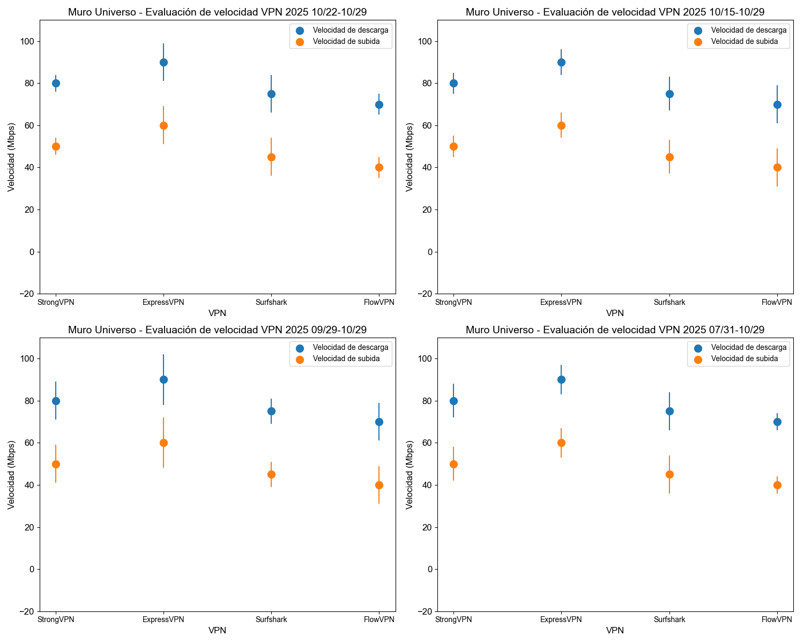

# Recomendación de VPNs globales - Actualización reciente

<!-- 
 -->

## Si te gusta este artículo, ¡dale una estrella en la esquina superior derecha y síguenos! Juntos, construyamos un mundo más libre y conectado.

### Conclusión directa sobre precio y calidad - Comparación de VPNs

### Características y diferencias de las cuatro VPNs recomendadas, con las mejores ofertas

| VPN Recomendada | Mejor oferta (duración) | Precio mensual (USD) | Precio total | Características | Pago internacional |
| --------------- | ----------------------- | -------------------- | ------------ | --------------- | ------------------ |
| [StrongVPN](https://strongtech.org/cn/exclusive/?tr_aid=60d96b5810e50&chan=w_github&data1=streaming&data2=title) | Compra 1 año | 4.5 | 54 | Mejor relación calidad-precio | Sí |
| [FlowVPN (prueba gratuita de 2 días)](https://www.flowvpx.com/sign-up/?locale=es&special=FREETRIAL&r=35-890485.w_github) | Compra 1 año | 4.17 | 50 | Prueba gratuita de 2 días | Sí |
| [ExpressVPN (compra 12 meses + 3 meses gratis)](https://go.expressvpn.com/c/3828265/1462855/16063) | Compra 1 año (15 meses total) | 5.33 | 6.67 x 12 = 80 | Máxima estabilidad y velocidad | No |
| [Surfshark](https://get.surfshark.net/aff_c?offer_id=323&aff_id=5585&source=w_github&aff_sub=streaming) | Compra 2 años | 2.30 | 55 | Dispositivos ilimitados | No |

### Gráfico comparativo de precios de VPNs - Estrategia para comprar al mejor precio

- Si planeas comprar por 1 año y no necesitas alta velocidad, te recomendamos [StrongVPN](https://strongtech.org/cn/exclusive/?tr_aid=60d96b5810e50&chan=w_github&data1=streaming&data2=title) por solo 43 USD (usa un nuevo email cada año con nuestro enlace de descuento), unos 4 USD al mes.
- Si planeas comprar por 2 años y no necesitas alta velocidad, te recomendamos [Surfshark](https://get.surfshark.net/aff_c?offer_id=323&aff_id=5585&source=w_github&aff_sub=streaming) por solo 55 USD (usa un nuevo email cada año con nuestro enlace de descuento).
- Si planeas comprar por 1 año y buscas alta velocidad, te sugerimos [ExpressVPN (12 meses + 3 gratis)](https://go.expressvpn.com/c/3828265/1462855/16063) (usa un nuevo email cada año con nuestro enlace de descuento), unos 6 USD al mes.
- Si solo necesitas leer papers y no exiges mucha velocidad, considera [FlowVPN](https://www.flowvpx.com/sign-up/?locale=es&special=FREETRIAL&r=35-890485.w_github).

Tras investigar y realizar múltiples pruebas, he recopilado datos de velocidad de VPNs en diferentes regiones, creando el siguiente gráfico para tu referencia. ExpressVPN lidera en estabilidad, seguido por StrongVPN, mientras que Surfshark y FlowVPN son similares. Depende de tu estrategia de compra. Aquí presento los resultados promedio de nuestras pruebas en regiones comunes, con barras de error para reflejar la variabilidad.

#### Gráfico de pruebas de velocidad de VPN, incluyendo subida y bajada.

Realizamos actualizaciones diarias y promediamos los datos de los últimos **7 días, 14 días, 30 días y 90 días**, con al menos 10-20 conexiones diarias. Detalles de nuestro equipo están al final del artículo. Las líneas horizontales representan la desviación estándar.

- **Resultados de pruebas de velocidad de VPN (últimos 7, 14, 30 y 90 días)**  
  

| Servicio VPN | WireGuard/Protocolo propietario | OpenVPN |
| ------------ | ------------------------------ | ------- |
| ExpressVPN   | 600 Mbps                      | 400 Mbps |
| FlowVPN      | 650 Mbps                      | 380 Mbps |
| StrongVPN    | 500 Mbps                      | 350 Mbps |
| Surfshark    | 800 Mbps                      | 300 Mbps |

- **Recomendaciones basadas en precio y velocidad**:
  - Si planeas comprar por 1 año y no necesitas alta velocidad, te recomendamos [StrongVPN](https://strongtech.org/cn/exclusive/?tr_aid=60d96b5810e50&chan=w_github&data1=streaming&data2=title) por 43 USD (usa un nuevo email con nuestro enlace), unos 4 USD al mes.
  - Si planeas comprar por 1 año y buscas alta velocidad, te sugerimos [ExpressVPN (12 meses + 3 gratis)](https://go.expressvpn.com/c/3828265/1462855/16063) (usa un nuevo email con nuestro enlace), unos 6 USD al mes.

La velocidad de conexión es clave para los usuarios de VPN. Si tu VPN ralentiza tu internet, es poco probable que la uses con frecuencia, dejando tus dispositivos expuestos. Hoy, una de las principales funciones de las VPNs es el streaming, donde cargar contenido en HD y 4K sin buffering es esencial. En nuestras pruebas, usamos una línea de 1 Gbps para evaluar cada servicio con herramientas como Ookla SpeedTest, nPerf, Netflix Fast y CLI. Tomamos el promedio (mediana) de cada herramienta para un rango de velocidad preciso, repitiendo las pruebas por la mañana y tarde para mayor precisión.

