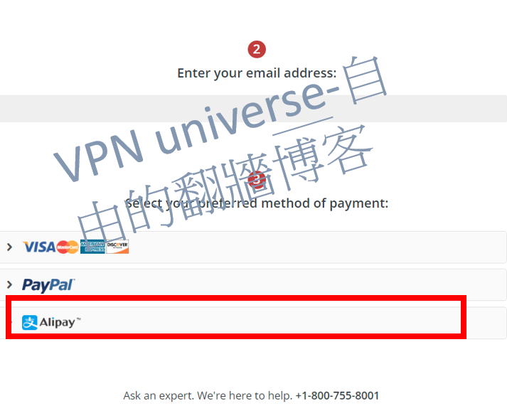
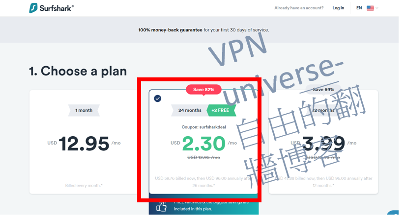
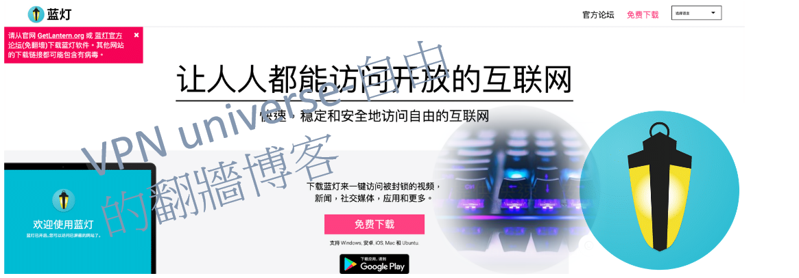
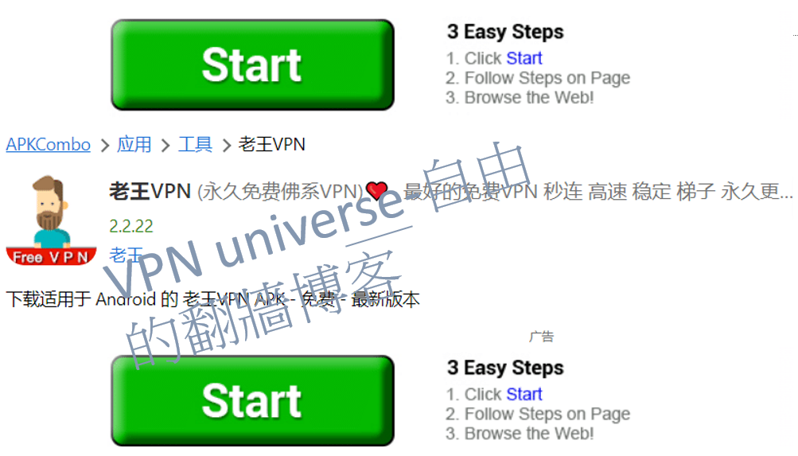
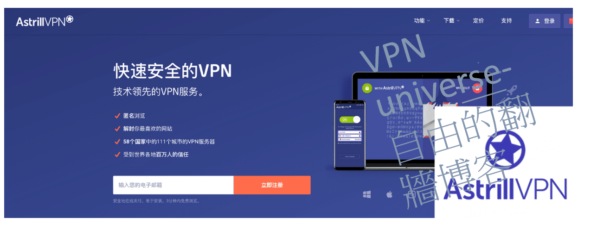
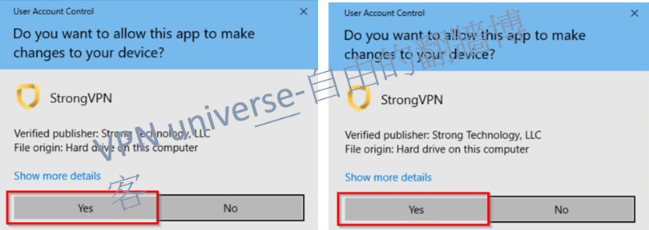
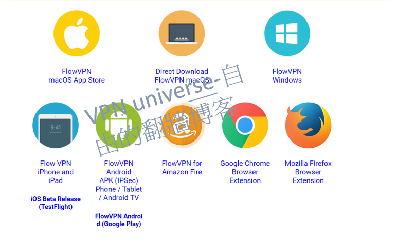

# 翻墙软件中国VPN推荐，推荐四款以下好用(2023年7月最新) 含性价比比较，只剩四款能用

# 喜欢本文的朋友，欢迎点右上方的star以及folk本文档案，让大家对翻墙有更深的认识，一起为自由而努力

### 直接看 价格性价比结论 墙宇宙 VPN价格 測速比较图

### 我整理出的四个VPN的特色以及差异，包含最优惠的购买方式

| 推荐的VPN | 最优惠买法(时间) | 一个月价格(美金)  | 总价 | 特色 | 支付保(Alipay) |
| ------------- | ------------- | ----- | ----- | ----- | ----- | 
| <a rel="nofollow noopener" href="https://strongvpn.com/?tr_aid=60d96b5810e50&chan=w_github&data1=pc-vpn&data2=table" target="_blank">StrongVPN</a>    | 一次买一年 | 3.66 | 43.99 | cp值最高 | 支援 |
| <a rel="nofollow noopener" href="https://www.xvbelink.com/?offer=3monthsfree&a_fid=wall101&chan=w_github">Expressvpn (买12个月送三个月)</a>   | 一次买一年(可用15个月)     |  5.33 | 6.67 X 12 = 80 | 最高级 速度稳定度最高 | 不支援|
| <a rel="nofollow noopener" href="https://get.surfshark.net/aff_c?offer_id=323&aff_id=5585&source=w_github&aff_sub=fanqiang">Surfshark</a> | 一次买两年    |    $2.30 | 55 |  无限多设备 | 不支援 |
|  <a rel="nofollow noopener" href="https://www.flowvpx.com/sign-up/?locale=zh-cn&special=FREETRIAL&r=35-890485.w_github">FlowVPN(免费试用两天)</a> |  一次买一年    |    $4.17 | 50 | 免费试用两天 | 支援 |

### 墙宇宙 VPN价格 比较图 怎样购买最便宜 (中國翻墻VPN購買的最佳策略)

- 如果打算一次購買一年，對於速度並不是太要求，建議買<a href="https://strongvpn.com/?tr_aid=60d96b5810e50&chan=w_github&data1=pc-vpn&data2=table">strongvpn</a>，只要43美金(隔一年再用一個新email使用本站優惠瑪)
- 如果打算一次購買兩年，對於速度並不是太要求，建議買<a href="https://get.surfshark.net/aff_c?offer_id=323&aff_id=5585&source=w_github&aff_sub=fanqiang">surfshark</a>，只要55美金(隔一年再用一個新email使用本站優惠瑪)
- 如果打算一次買一年且對速度要求很高，當然建議買<a rel="nofollow noopener" href="https://www.xvbelink.com/?offer=3monthsfree&a_fid=wall101&chan=w_github">Expressvpn (买12个月送三个月)</a>(隔一年再用一個新email使用本站優惠瑪)。一個月大概6美金
- 如果只是想要念paper，速度上不那麼要求，可以考慮<a href="https://www.flowvpx.com/sign-up/?locale=zh-cn&special=FREETRIAL&r=35-890485.w_github">flowvpn</a>

經由我研究和多方的測試，針對不同地區蒐集到的VPN的測速資料，做成以下圖片給大家參考。Expressvpn速度穩定度最高，strongvpn次之，surfshark和flowvpn差不多。就看大家的購買策略。以下是我針對 四款VPN在台灣，日本，南韓，等常見地區的平均，經過多次測試並且畫出標準差(error bar)。考量到價格跟速度比較，
我認為:

- 如果打算一次購買一年，對於速度並不是太要求，建議買<a href="https://strongvpn.com/?tr_aid=60d96b5810e50&chan=w_github&data1=pc-vpn&data2=table">strongvpn</a>，只要43美金(隔一年再用一個新email使用本站優惠瑪)，一個月大概4美金
- 如果打算一次買一年且對速度要求很高，當然建議買<a rel="nofollow noopener" href="https://www.xvbelink.com/?offer=3monthsfree&a_fid=wall101&chan=w_github">Expressvpn (买12个月送三个月)</a>(隔一年再用一個新email使用本站優惠瑪)。一個月大概6美金

最近更新：`2023年6月12日`

>**在當前的環境下，能在國內長期穩定並有效使用的VPN服務已經變得相對稀缺。許多VPN評論網站往往互相抄襲，發布的內容很多都已經失去了時效性。有一部分推薦的VPN在國內的實際效果并不理想，令人遺憾的是，很多的評論者身處國外，他們並無法提供在國內使用VPN的真實體驗。特別是在過去的兩年中，由於"防火長城"的嚴密封鎖，許多過去可用的VPN現在已經變得幾乎無法使用。因此，在閱讀本文的同時，我建議大家需要謹慎理解並避免進入"坑"。本文將根據實際的使用經驗介紹各種VPN軟件的最新使用情況，並將持續更新最新的使用情況，以供大家參考和避坑。本文是關於中國安全翻牆策略的詳細版本，討論了翻牆軟件、科學上網以及網絡安全等相關問題。如果你只希望快速選擇一款科學上網軟件來翻牆，那麼可以直接查看本文下方的目錄導航。

翻牆（科學上網）的重要性，我想大家心裡都有數。否則，你現在也不會在這裡閱讀這篇文章。如果不能翻牆，就不能使用Google搜尋編程代碼，不能回覆Gmail郵件，也無法觀看YouTube的視頻。那些在Udemy購買的課程，你能夠舒適地觀看嗎？你能否追蹤HBO和Netflix的劇集？由於工作出差和生活學習的需要，我經常需要在不同的地區使用科學上網。基於我的個人使用感受以及對VPN軟件這個行業的理解，我將為讀者推薦在國內最好用、最穩定和最安全的科學上網方法和工具。我也將長期關注VPN、SSR、WireGuard、V2Ray、藍燈等翻牆和信息安全技術。

>**据中央社引述中国官方消息报道，中国上网人数突破9亿，网购用户超过7亿，可见大家对上网的需求日益增加, 有鉴于网路上许多博主到处乱推荐VPN，都推荐一堆不能用的，不能用的就算了，还要骗大家去买来拿钱，这类博客有个特点，就是喜欢自己架一个网站，写一堆话来骗大家，近几年来，防火墙更新越来越强大，过去许多VPN已经完全不能使用。为了让大家能够持续的有知的自由，再加上太多网站喜欢说不实的讯息，我决定在github上建造一个网页，作为自由博客，帮助大家避坑，不要再浪费时间在那些危险的VPN或是不能用的VPN上。本文会介绍细节，讲一些技术，只想看翻墙科学软件推荐的朋友(如果只想快速选个科学上网软件来翻墙)，可以直接看我的推荐栏位。

多年中美工作经验告诉我，翻墙几乎是现代人必备的一个技能，由于言论审查，只要翻不了墙就不能Google学新的东西，不翻墙就不能看YouTube视频，用facebook，line和外国朋友联络，Coursera和Udemy等线上课程都不能好好观看。HBO、Netflix等影视娱乐也必须要翻墙才能观看，BBC,CNN等国际新闻也都必须要借由翻墙才观看。我本人由于跨国工作，经常要在不同地区使用科学上网，我本人自己也是网路程序员，博士是研究机器学习，也研究过网路相关问题，我将会在下面详细介绍VPN、SSR、WireGuard、V2Ray、Trojan等翻墙和信息安全技术和基本加密技术，我也将就自己的使用感受和对翻墙软件的了解，自己进行数值实验和速度测试，为读者推荐在国内最好用、稳定和安全的科学上网方法和工具。

## 翻牆近況更新
**从2021年的圣诞季节到2023年五月的春末，这一段缤纷却又多事的时光，我们在VPN的世界里看到了许多变化。**那些曾经的大腕如Ivacy、VyprVPN、和蓝灯，在中国的市场里屡遭挫折，似乎正如那浓烈的火锅汤底对于胃的挑战一样，它们的伺服器经常遭受封锁。特别是蓝灯，其安全性就像那灯下的虫子，暴露在我们的目光之下。在此，我们要对所有的用户喊话，请注意躲避这些隐患。那些曾经坚固的城堡如NordVPN，在这场风暴中也是被重点打击，现在可以说是倒下的巨人，它的表现就像一个突然失去了方向的孩子，常常需要手动配置。那个我们曾经称之为“小明星”的PIA，在这场狂风中失去了光芒，被封锁后一直无法有后续的有效反击，目前在国内还是无法连接，请大家谨慎选择。

神秘的PandaVPN就像是一个离家出走的孩子，从11月的深秋开始，就像那渐渐落叶的树一样，官网无法访问，线路无法连接，即使呼喊，也无人回应，我们怀疑他可能已经选择了别的路，去寻找自己的世界，选择了卷款跑路。很多专为国人服务的翻牆软件都在走这条路，大家需要提高警惕，毕竟，世界是美好的，也是充满了挑战。

然而，就像那永不消逝的北斗星，**只有ExpressVPN和StrongVPN在过去几年的表现一直保持着稳定，就如同坐在海边听着浪潮的声音一样令人放心。ExpressVPN像是我们的瑞士刀，适用于所有平台，使用体验就像是骑在风中自由的马上，即使遭遇到封锁，它也能在一周内恢復，只要更新了程序，就像是喝了神奇药剂一样，官方推荐的线路就能恢復正常连接。StrongVPN则是我们的轻装步兵，价格相对便宜，拥有通用版客户端和特供的简化版客户端可供使用，无论是Windows、Mac还是安卓手机端，都能适应。**它们的伺服器线路就像是快速的马车，不时会更新，过去的两年里被封锁的次数也相对较少。但是如果你是iPhone的用户，使用StrongVPN可能需要像是打开一道神秘的门一样，联繫客服手动配置翻牆。而在这种敏感的时期，如果遇到连接问题，你可能需要像是找到藏宝图一样，联繫客服提供国内可用线路或备用线路。

> ## 本文内容导航
> ### 1. [科學上網基本知識](#科學上網基本知識)
> ### 2. [国产VPN推荐功能总结—2023年7月测试](#国产VPN推荐功能总结—2023年7月测试)

## 科學上網基本知識

### 什么是科学上网?

首先必須要來介紹防火牆的基本知識
#### 防火牆基本知識 (什麼是防火墻)

中国防火墙是一项全国性的政策，號稱在保护中国企业和国家机密以及基础设施免受网络攻击。该计划由中国公安部 (MPS) 监督，官方称该项目为金盾。
由于担心中国政府正在利用网络安全作为控制该国公民可以访问哪些信息的理由。被防火墙封锁的网站包括Facebook、YouTube、Instagram、Vimeo、Spotify、Snapchat 和 Tumblr。
纽约时报、CNN、路透社和金融时报，Instagram，路透社，Snapchat，华尔街日报

被防火墙阻止的网站通常看起来好像遇到了技术问题。浏览器通常会返回错误代码，表示未找到页面（404错误）、需要重置连接或页面已超时。防火墙通过多种方式阻止和重定向互联网流量，包括DNS 中毒、IP 地址阻止、分析和过滤 URL、数据包检查和过滤、重置连接和阻止VPN。
与其他几个国家一样，政府会标记某些关键字以监控活动。多个消息来源证实，截至 2019 年 4 月，中国已屏蔽所有语言 URL 的维基百科

#### 为什么要翻墙？

原因很簡單:如果没有用VPN要翻墙，在中国远程工作會變得很困难，因为 Slack、Microsoft OneDrive 和 Dropbox 等公司常用的作業应用程序都被禁止。整个 Google 套件（包括 Gmail 和 Google Drive）也无法使用。其他被禁止的社交网络包括 Facebook、YouTube、Instagram、Vimeo、Spotify、Snapchat 和 Tumblr。这会使与你和你朋友家人保持联系变得非常困難。 

大多数西方新闻网站也是禁止访问的。其中包括纽约时报、CNN、路透社和金融时报。在中国被禁止的网站和服务列表是不断变化的

#### 科学上网的由来
VPN 技术如何帮助规避互联网审查？

虚拟专用网络(VPN)可以帮助您绕过中国的互联网审查制度，通过欺骗互联网服务提供商认为您位于中国境外。 
虽然在中国使用 VPN 在技术上是非法的，但对使用 VPN 的游客或商人的起诉几乎闻所未闻。
但是，有一些重要的考虑因素。首先，在您到达中国之前下载 VPN 至关重要，因为大多数 VPN 网站在中国都被禁止使用，这并不奇怪。其次，我们建议使用久经考验的 VPN，例如ExpressVPN或strongVPN。这些供应商不断证明他们可以通過中国的互联网防火墙。為了不被發現，大家常利用: 科学上网、梯子、机场等词汇来替代VPN、翻墙等词來避開互聯網審查。

总的来说，大陆网民使用特定的工具去访问海外网站的这个过程就叫作“翻墙”或者“科学上网”，而这些特定的工具我们一般称之为“翻墙软件”或者“翻墙VPN”或者“翻墙工具”或者”科学上网工具“。

#### VPN的其他好處: 为什么要隐藏 IP 地址？
IP 地址就像街道地址一样。它公开识别你的实际位置，并且对你来说是独一无二的。但是，你的 IP 地址也可能对你不利——第三方可能会使用它来监视你的活动和跟踪你的位置，現在通过用VPN服務器的 IP 地址交换你的 IP 地址，VPN廠商会立即加密你的连接并在几秒钟内隐藏你的真实在线身份。VPN的私有、安全网络将安全地汇集你的流量，使其完全不受第三方的影响。

#### VPN的其他好處二: 使用公共 Wi-Fi 可能会有风险
无论你是在咖啡店、机场还是酒店，公共场所通常都会提供免费 Wi-Fi 的便利。然而，这些繁忙的热点带来了巨大的风险：将你的数据暴露给黑客。
虽然公共 Wi-Fi 很容易访问，但在没有 VPN 的情况下使用它时被黑客入侵的风险會非常高。与你在同一网络上浏览的任何人都可以在未经你同意的情况下访问你的私人信息。你的银行和金融信息
，工作沟通訊息，電話号码，电子邮件和短信数据都有一定的風險。只要你连接到VPN的安全网络，你就可以在热点在线浏览时安心使用你的wifi数据。

### 常见的主流翻墙软件协议
以下是与翻墙相关的几个专业术语。了解这些术语可以帮助您在选择翻墙时获得更好的基本信息，并且更多可以是整个组织中最彻底和详细的专业分类 - 包括实践。如果你只是想快速翻墙，可以直接看翻墙推荐软件。

- **VPN**
知道如何翻墙成功的同伴可能听说过 VPN 一词，以了解 VPN 与什么连接。 VPN目前是一种加密策略，可以保护客户的IP、区域和个人数据不被泄露。 VPN 可以被视为一种伪装（如果从学术上讲，加密更重要的话）。在屏蔽（加扰）客户端 IP、IP 和个人数据后，他们可以通过防火墙到达一些墙外世界。
同时，多数人频繁使用 VPN 背后的动机并不是来通过防火墙（就像我在Covid期间同时看到许多远端工作者VPN 一样）。然而这类传统VPN的已经不足以应付中国政府利用强大的国家优势制造的超级防火墙，传统的VPN在中国已经没有机会了。

## 国产VPN推荐功能总结—2023年7月测试
以下是我从数百个VPN中实际测试过的一些中国最好的VPN。实际测速对比，可以参考下方测速报告段落。我在中国从事与美国的贸易工作多年。 我用过很多互联网推荐的翻墙软件。我认为一个好的软件应该包括以下功能：

- 高安全性（非中国公司，尽量不要设在中国）
- 连接稳定
- 越快越好
- 更多节点（可连接更多国家）
- 简单易用（一键翻墙）
- 拥有最强的加密隐私安全功能
- 支持同时连接多个设备
- 兼容性强：包括可以同时使用windows、linux、android等设备的设备
- 7天24小时中文客服
- 有30天退款机制
- 有多种支付方式
- 价格正常（公平合理），CP值正常

### 1.<a rel="nofollow noopener" href="https://strongvpn.com/?tr_aid=60d96b5810e50&chan=w_github&data1=pc-vpn&data2=table" target="_blank">StrongVPN–性价比最高</a>

### StrongVPN推荐

StrongVPN属于最近兴起的欧美VPN。与欧美最大的ExpressVPN相比，价格便宜很多，最低每月3.5美元（12个月计划-每月3.5美元（总费用43.99美元）。ExpressVPN费用接近6美元不仅如此， StrongVPN支持支付宝，ExpressVPN不支持。还有一个工程团队不断更新和修复节点。如果你只是想在线观看YouTube或Facebook，我推荐StrongVPN。StrongVPN网站声称它是“最好的多媒体VPN”，并且建议支持 Netflix、Hulu、ABC、HBO 和 Sky Go 等服务。

StrongVPN 拥有适用于 Windows、Mac、iOS、Android 和 Amazon Fire TV 的应用程序，例如 Chrome 浏览器扩展程序，以及路由器、Fire TV、Kodi 等的设置指南。 StrongVPN 在超过 35 个国家的 46 个城市提供超过 950 台 P2P 友好服务器。您可以通过 L2TP、SSTP、OpenVPN、IKEv2 甚至现在的 WireGuard 协议进行连接，并通过电子邮件和实时聊天获得 24/7 客户支持以及 30 天退款保证。没什么花哨的，但规格很不错，对大多数人来说绰绰有余。

strongvpn设计了一个全球网络，其中包括 950 多台服务器，支持 30 多个国家和 46 个城市，并提供 59,500 个 VPN。真正在线隐私的零日志记录: StrongVPN 是业内少数可以承诺零日志记录的 VPN 之一。因为strongvpn拥有自己的服务器，所以有能力控制谁和什么可以访问你的数据。绝不会将您的私人信息或活动交到任何第三方手中。strongvpn对将您的数据出售给出价最高者不感兴趣。只是想帮助您保持安全。

**12个同时连接**一次最多可以在十二台设备上使用 StrongVPN

### Strongvpn 的特色

介绍StrongVPN的功能：

- 广泛的平台支持 适用于 iOS、Android、macOS、Windows 等的应用程序
- 最多支持 12 个同时连接
- 解锁 Netflix、Amazon Prime Video、Disney Plus
- 250GB SugarSync 存储空间，包年套餐
- 超过 8000 台服务器
- 可以通过 L2TP、SSTP、OpenVPN、IKEv2 甚至 WireGuard 协议进行连接
- 只要你在购买后 30 天内提出要求，你就会收到全额退款
- 如果你有任何问题或困难，熟练的技术人员团队将随时为你提供帮助。我们提供 24/7 客户支持，确保及时解决所有问题
- StrongVPN的隐私政策：在您使用VPN服务时，您的数据不会被跟踪或存储
- 价格比ExpressVPN、Surfshark等欧美VPN便宜。最近，测试节点的速度和数量已经超过了ExpressVPN。
- 支持支付宝。(接受所有主要信用卡、PayPal、支付宝)
- 高稳定性
- 每月只需3.50 美元（12 个月计划 – 每月 3.50 美元（总成本 43.99 美元）

### 2 <a rel="nofollow noopener" href="https://www.xvbelink.com/?offer=3monthsfree&a_fid=wall101&chan=w_github">Expressvpn (买12个月送三个月)</a>
### Expressvpn (买12个月送三个月)

### Expressvpn 的特色

VPN市场有很多竞争，但 ExpressVPN 在其中脱颖而出：它拥有专业的功能，提供的方式比其他任何人都多。
一流的平台支持包括适用于 Windows、Mac、Android、iOS、Linux 和其他操作系统的应用程序，更不用说许多路由器的自定义固件，以及 Apple TV、Fire TV、PlayStation、Chromebook、Kindle 的详细手动设置指南等等。一组强大的核心功能提供了多层保护。例如，ExpressVPN 通过使用自己的 DNS 服务器来保护您的互联网流量。高端加密技术甚至可以防止最先进的攻击者窥探您的活动。即使 VPN 掉线，也没有问题：高质量的终止开关会立即激活以阻止您的互联网连接并确保您的安全。

该公司提供由 3,000 多台服务器组成的庞大网络，遍布 94 个国家的 160 个城市。欧洲和美国的覆盖范围最好，但 ExpressVPN 在亚洲也有很多地点和几个在其他地方很少出现的国家。例如，仅亚太地区就有 27 个国家——Mozilla VPN在其整个网络中只有大约 30 个国家。ExpressVPN是全球最大的VPN公司，提供自有资源快速更新，ExpressVPN拥有超宽网络（3000多台服务器的安全网络），提供，快速，连接Netflix和几乎所有内容，支持种子下载，绝对记录用户日志记录，几乎所有人都可以使用。 每次当前监控的百分比总是在稳定区域同步更新。在国内达到九成翻墙成功机率，是墙体成功率最高的欧美公司。它属于最高级别的VPN，唯一的问题是价格有点高。

ExpressVPN 的隐私保护使用工业级加密。Diffie-Helman 密钥交换可以安全地建立与远程服务器的链接，而 AES-256-GCM 支持可以保护您的数据免受即使是装备最精良的攻击者的攻击，而强大的 HMAC 身份验证可以防止数据被实时更改。DNS 支持是另一个亮点。ExpressVPN 不仅提供 DNS 泄漏保护以防止有关您的在线活动的数据从VPN 隧道泄漏，而且还在其每台服务器上运行自己的私有、零知识、256 位加密 DNS。与一些较小的提供商相比，这是一个主要优势，在最坏的情况下，它们可能会将您的 DNS 流量重定向到 OpenDNS 或其他一些第三方服务。除了在 DNS 服务器上登录的风险外，使用未加密的 DNS 使攻击者有机会拦截您的请求、过滤它们、阻止甚至更改它们——使用 ExpressVPN 的方法在很大程度上消除了所有问题。

特点如下：

- 多达 160 个地点，遍布 94 个国家/地区
- 非常多的用户
- 每次开机，总能快速更新服务器
- 30天內無條件退款
- **24/7** 客户服务
- 适用于 Windows、Mac、Android、iOS、Linux 和其他操作系统的应用程序
- 还包括 Apple TV、Fire TV、PlayStation、Chromebook、Kindle
- ExpressVPN 提供各种货币的支付方式，甚至比特币
- 工业级加密

还有一些方法可以节省一些现金。注册我们的独家优惠可以買一年得ExpressVPN订阅 多增加三个月的免费服务，为您提供 15 个月的服务，每月有效 6.67 美元。

如果您决定注册，您会发现各种各样的支付方式，包括卡、PayPal、比特币和许多其他参与者（支付宝、Yandex Money、WebMoney 等）。

**安装 Android 或 iOS 应用程序可以获得 7 天的试用期，ExpressVPN 的 30 天退款保证也让您可以安全地为自己检查服务**

**如果您决定取消，该过程也非常简单。您不必向公司证明您的决定是合理的。您可以完全使用该服务 30 天，如果您不满意，或者只是改变主意，只需告诉 ExpressVPN，您将获得退款。完全不需要擔心。**

### 3 <a rel="nofollow noopener" href="https://get.surfshark.net/aff_c?offer_id=323&aff_id=5585&source=w_github&aff_sub=fanqiang">Surfshark (具有无限多设备连接)</a>
### Surfshark VPN (冲浪鲨) 推荐

Surfshark 是一款高度精致且功能强大的 VPN，可与最好的优质提供商竞争，同时提供极具吸引力的价格点。我们发现终止开关存在一些非常小的问题，而且 OpenVPN 的速度并不是最好的，但是以这个价格，你找不到更好的 VPN。Surfshark 在网络上受到广泛推荐，成立于 2018 年，是一项相对较新的服务，已经引起了轰动，现在它能与最大的VPN提供商一较高下，被认为是市场上最好的 VPN之一。
Surshark具有丰富的功能，几乎可以在任何地方运行，并且拥有最有价值的VPN之一。该网络拥有 3,200 多台服务器，分布在 65 个国家的 160 多个地点。

有 Windows、Mac、iOS、Android 和 Linux 应用程序，以及 Chrome、Firefox 和现在的 Edge 扩展程序，以及一个用于游戏机、智能电视等的解锁智能 DNS 系统的网站。

加密方面使用强大的 AES-256-GCM 加密、WireGuard、OpenVPN 和 IKEv2 支持、无日志策略以及在 VPN 连接断开时會自動啟動保护您的設備的终止开关。与ExpressVPN一样，Surfshark 位于英属维尔京群岛，该公司指出，这表示他不會需要保留用户操作日志。Surfshark 的无日志政策 表示该服务不会收集您的“IP 地址、浏览历史记录、使用的带宽、会话信息、网络流量或连接时间戳”。公司保留的关于您的唯一数据是您的电子邮件地址和账单信息

Surfshark可以解除对 Netflix的封锁，而且还列出了近20 个国家/地区包含美国、法国、日本、意大利、澳大利亚等都可以访问美国 Netflix。Surfshark 也可以觀看美国亚马逊 Prime 和 Disney Plus

### Surfshark VPN 的特色
- 介绍性优惠超级便宜
- 全新的安全审核让您高枕无忧
- 出色的流媒体性能
- Surfshark 的支付方式支持信用卡、PayPal、加密货币、Amazon Pay 和 Google Pay。
- 客户支持非常有用
- Surfshark 在 65 个位置拥有 3,200 多台健康的服务器和无限的同时连接，加上行业标准的 AES-256-GCM 加密
- **无限多台设备连接**
- 如我您注册后发现该公司不适合您，您有 30 天退款保证的保护。
- Surfshark 最大的吸引力在于它的价格，在撰写本文时，**2 年计划的价格为每月 2.30 美元。是我见过最便宜的VPN厂商**
- Surfshark Nexus 将在 2022 年和 2023 年提供新功能，**IP Rotator 每隔几分钟就会自动更改您的 IP 地址，而无需断开连接。**

### 4 <a rel="nofollow noopener" href="https://www.flowvpx.com/sign-up/?locale=zh-cn&special=FREETRIAL&r=35-890485.w_github">FlowVPN(免费试用两天)</a>
### FlowVPN 推荐

### FlowVPN 的特色(两天免费试用)

- 超級棒的两天免费试用
- 便宜好用，适合学生使用
- 属中囯VPN，稳定度速度输欧美VPN厂商，參考我上面測速照片。
- 支援支付宝上网，有中文介面跟客户服务
- 支持的协议包括 IPSec IKEv1、IPSec IKEv2、Wireguard、OpenVPN、L2TP 和 PPTP。
- flowvpn自定义 SSL 和 FlowTCP 协议。
- 覆盖全球 60 多个国家/地区的 100 多台服务器，包括英国、美国、香港和澳大利亚。
- 适用于 Mac、iPad、iPhone、Android 和 Windows
- 在最多 4 台设备上同时使用
- FlowVPN 为学生和教职员工提供学生折扣

## Strongvpn 手把手购买教学 (支付保(alipay))
strongvpn的特点就是有支付保(alipay)喜欢支付保的付款的朋友，建议使用strongvpn，或是flowvpn

第一步骤: 前往本站的专属优惠 <a rel="nofollow noopener" href="https://strongvpn.com/?tr_aid=60d96b5810e50&chan=w_github&data1=pc-vpn&data2=table" target="_blank">StrongVPN</a>，点选start now (参照下图)

第二步骤: 如果你开启后发现你没办法购买，因为你正在使用其他VPN，这时候可以先透过註册flowvpn(註册方式可以参考下方的flowvpn安装教学)，flowvpn有两天免费试用，你可以先使用他来购买strongvpn。

註册完flowvpn以后，选择UK，你会发现你就可以购买囉。左边的一次买一年只要43美金，(注意: 这个方式只能使用12个月，如果要续约，建议重新办一个email,再回来使用这个优惠玛。)

第三步骤: 往下滑，选择alipay付款，或是国内银行卡，包含visa或是master card(海外卡也可以)，还有paypal可以用

## Expressvpn 线上优惠玛购买教学 (如何购买ExpressVPN) 要注意: expressvpn 不支援支付宝，喜欢支付保的付款的朋友，建议使用strongvpn，或是flowvpn。
Expressvpn 支援: 国内银行卡购买ExpressVPN，包含visa或是master card(海外卡也可以)，还有比特币，还有paypal可以用。因为expressvpn 是海外网站，所以你可能需要翻牆才能访问。关于这点，可以参考我的镜像站连上网站的方法。

### 第一步: 前往优惠连结<a rel="nofollow noopener" href="https://www.xvbelink.com/?offer=3monthsfree&a_fid=wall101&chan=w_github">Expressvpn 优惠</a>:点选: get expressvpn (底下的红框框)

### 第二步: 你可以看到 买一年送三个月得连结，所以你只要付12个月的钱，但可以使用15个月(注意: 这个方式只能使用15个月，如果要续约，建议重新办一个email,再回来使用这个优惠玛。)

### 第三步: 输入的电子邮件和付款方式。(Expressvpn 支援: 国内银行卡购买ExpressVPN，包含visa或是master card(海外卡也可以)，还有比特币，还有paypal可以用)，千万不要打错。不然你就收不到验证码了。

## Surfshark 手把手购买教学
### 第一步: 前往surfshark优惠玛: <a rel="nofollow noopener" href="https://get.surfshark.net/aff_c?offer_id=323&aff_id=5585&source=w_github&aff_sub=fanqiang">Surfshark (具有无限多设备连接)</a> 点选: get (参考下方教学图片)

### 第二步: 你可以看到 一次买两年的优惠连结，所以你只要付24个月的钱，一个月不到3美金 (注意: 这个方式只能使用24个月，如果要续约，建议重新办一个email,再回来使用这个优惠玛。)

### 第三步: 输入的电子邮件和付款方式。(Surfshark 支援: 国内银行卡包含visa或是master card(海外卡也可以)，还有比特币，还有paypal可以用)，千万不要打错。不然你就收不到验证码了。

## flowvpn免费试用两天 手把手购买教学

### 第一步骤: 按照上面的方式购买完成以后，到<a href="https://www.flowvpx.com/download/">flowvpn官方网站</a> 下载自己的使用设备
有windows, mac, android, iOS 可供选择。

### 第二步骤: 打开安装档案，输入帐号密码，即可开始使用。

### 第一步: 到 <a rel="nofollow noopener" href="https://www.flowvpx.com/sign-up/?locale=zh-cn&special=FREETRIAL&r=35-890485.w_github">FlowVPN(免费试用两天)</a> 输入电子邮件跟密码 (千万不要出错)

### 第二步: 通过人机验证: 这裡选狗的照片

### 第三步: 就可以下载flowvpn (支援: 国内银行卡包含visa或是master card(海外卡也可以)，还有alipay)

### 中国特殊时期的VPN连接问题 (敏感时期)
在中国的“敏感期”，所有的翻墙工具都会出现连接不畅、断线等问题。 一年中几乎所有的连接问题都会在此期间发生。 这是因为中国政府高度重视政治稳定，并且在此期间经常会收紧互联网限制。 因此，在这个敏感时期，位于中国的 VPN 服务器经常出现连接不良和断开连接的问题。 但是，用户可以采取一些步骤来尽量减少这些限制的影响。 例如，使用位于中国境外的 VPN 服务器可以帮助减少遇到连接问题的可能性。 此外，选择在可靠性和速度方面享有盛誉的 VPN 服务器也很重要。 通过采取这些措施，用户可以帮助确保他们能够在中国的敏感时期自由浏览互联网。有底下常见的几个敏感时期:

## 两会期间
根据这几年的经验，在国内召开会议的时候，基本上是很难接入外网的。 在这两次会议期间，情况更糟。 大部分的一线VPN和大部分商业科学互联网软件都会失效，能连接的节点会变得非常少。 有些VPN切换到其他协议后可以使用，但速度极慢。 会议组织者可以专门为参会人员提供一个临时的VPN账号，可以通过IP认证或者MAC地址绑定来访问。 也可以使用拨号网络服务连接到一些会议组织者提供的国际电话会议。 但是，由于中国的线路条件和政策限制，这些方法并不总是有效的。 

## 特殊状况
当谈到黑天鹅事件时，真的不知道它们何时何地会袭击。 近年来，从covid-19的爆发到香港的人权抗议活动，我们已经看到了其中的一些发生。 这些事件中的每一个都让我们措手不及，让我们争先恐后地想办法应对。 在 covid-19 的案例中，我们看到很多互联网软件在中国被封锁，使人们难以保持联系。 这可能是由于政府努力控制有关病毒信息的传播。 然而，这也可能只是一个更严重问题的开始。 只有时间会给出答案。 无论哪种方式，重要的是要为可能发生的任何事情做好准备。

### 为什么不在自己的计算机 上建立VPN（建立自己的梯子）来翻墙呢？
有人会担心，海外VPN不依赖大众。看到老王VPN、Lantern VPN等案例后，被警察叫去喝茶，所以想自己建VPN，自己架服务器。在这里，我强烈建议不要建立在自己的计算机VPN建立翻墙软体，原因如下。
- 1 虽然网上有很多流行的开源协议如SSR、V2ray、木马等搭建天梯，但如果你有一定的技术实力，可以考虑自己做，但很可能会浪费很多时间。原因很简单，因为这些开源软件，中国的开发者也能看到，他能看到你的代码，他肯定早就和你打过交道了。以前的蓝光VPN开源软件一开始可以用，现在不能用了。
- 2 其次，需要自己花钱架设服务器。服务器非常昂贵，需要维护。你必须永远不能断电，所以你的家庭服务器必须一直打开。你可以成功翻墙。更新防火墙后，您还必须一起更新算法。为什么要自己造轮子？
- 3 你只要在国内搭建或是卖翻墙工具就是明确违法行为，违反《中华人民共和国计算机信息网络国际联网管理暂行规定》)，就算你只是个人使用，保证违法。如果你再分享给朋友使用，你就明确违法，这就不单单只是被公安叫去喝茶罚500这么简单

### 为什么不推荐免费的VPN？
有人会问：为什么不推荐免费的电脑VPN？

- 1 免费电脑VPN有广告。如果有广告，你的速度会变慢，影响你观看视频的体验。
- 2 免费电脑 VPN 通常有一个未知的公司地址。跑了，找不到人负责，尽量不要用，浪费时间
- 3 免费电脑VPN可能含有恶意软件、木马程序，您的个人信息可能会被窃取，包括信用卡、个人账号密码等信息，由于免费且不承担任何法律责任，可能含有挖矿软件。
- 4 根据这几年被公安叫喝茶的经历，都是免费的VPN外包，最着名的就是老网VPN和彩灯VPN的案例。我们再看一个公安叫来的免费VPN喝茶的例子。 .
结论：永远不要碰任何免费的VPN。你报警喝茶的罚款就够你买一年的ExpressVPN了。

### 为什麽不推荐自己建造伺服器 自己架设VPN?

您可能想要设置自己的 VPN 服务器的原因有很多。 也许您想提高安全性或访问受地理限制的内容。 但是，出于多种原因，我们不建议您构建自己的 VPN 服务器。 首先，它很贵。 您需要投资强大的硬件和软件，并且需要为可靠的互联网连接付费。 其次，它很耗时。 设置和维护 VPN 服务器是一个复杂的过程，需要大量的技术专长。 最后，风险很大。 如果您不小心，您的数据可能会面临恶意软件和数据泄露等风险。 出于这些原因，我们建议使用商业 VPN 服务，而不是设置您自己的服务器。

### 不推荐使用任何破解软件
出于多种原因，不推荐使用破解软件。 破解软件通常不稳定且充满错误。 此外，破解软件通常缺乏与官方版本相同级别的客户支持和保护。 破解软件还会使您的计算机面临病毒和其他恶意软件的风险。 最后，许多生产破解软件的公司实际上是骗局。 他们可能会承诺免费或打折访问他们的软件，但是一旦你下载它，你可能会发现它不像宣传的那样工作。 简而言之，破解软件通常是一项糟糕的投资。 你最好把钱花在软件的官方版本上，或者找到一个免费的替代品。

### 翻墙软件中国VPN推荐
总结一下，绕过防火墙的方法有很多，但以我自己的经验，购买付费 VPN 仍然是大多数用户的最佳选择。本文推荐的VPN不仅适用于Windows用户，还可以安装在手机、平板等操作系统上。这些VPN基本上使用起来非常方便。
而且虽然我们说的是VPN技术，但是现在大部分主流的VPN都包含了SSR、Trojan、V2ray等开源方式，所以基本上是所有技术的融合。
最后，让我们谈谈免费 VPN。我不建议您使用任何免费的计算机 VPN。首先，能不能上网是个问题，而且你可能安装了恶意挖矿软件，会给你的信息安全带来很大的隐患，所以真心建议大家不要贪小便宜，你甚至可能会被要求喝茶。你可以看到我提到的老网VPN和蓝灯VPN的案例。
如果您对电脑VPN有任何疑问，请在下方留言，我会一一解答。

## 中国翻墙VPN黑名单(千万不要入坑，不要使用)

### 熊猫VPN
熊猫VPN是翻墙软件市场的后起之秀。 PandaVPN又叫“熊猫VPN”，公司成立于2018年，总部位于塞舌尔共和国， 官网是：pandavpn.pro 。 主要服务对象为中国大陆网民和在海外的华人华侨。但据我所知，PandaVPN在国内翻墙效果并不稳定。且网站虽然号称支持支付宝、微信、银联卡等国内付款方式。且有7天退款保障。但有许多网友表示，七天退款非常困难，就算申请退款，也几乎没有人回信。而且把国家设置在奇怪的小国家，有另外一位博主: [墙博士](https://dr-wall.com/pandavpn/)，仔细研究过熊猫VPN的连接和公司地址。可以发现付款的公司地址和塞舌尔共和国不一致，让大家感到非常担心。建议不要使用。

### 蓝灯VPN
蓝灯(Lantern)是一款用于突破网络审查的开源代理软件，过去效能很好，然而这几年，蓝灯VPN为中国最危险的VPN之一，2019年初，广东省警方对蓝灯用户以“擅自创建、使用非法定信道进行国际联网”，违反《中华人民共和国计算机信息网络国际联网管理暂行规定》之依据进行处罚，罚款人民币一千元。并且该处罚在“广东公安执法信息公开平台”进行公示。所以蓝灯VPN基本上已经被中国政府破解，基本上已经不能在使用了。建议大家不要再尝试，否则被叫去喝茶。
这点可以参考:[Lantern翻墙被抓新闻](https://www.williamlong.info/archives/5573.html)

另一个事件为:
中国年轻一代更因此被称为“信息柏林墙内长大的新世代”。一则官方通告显示，浙江省舟山市一名男子就因为“翻墙”查找资料，就被警察上门“查水表”。
中共官方网站“浙江政务服务网”日前发布公告称，张韬在2019上半年至2010年10月间，通过百度搜索到翻墙软件Lantern后下载安装，并多次利用Lantern“非法”访问维基百科查询资料，24日遭警方逮捕。
这点可以参考: 
[Lantern翻墙被抓新闻](https://www.soundofhope.org/post/437092)

### ProtonVPN
Proton VPN在2018年以前也是一个很火红的VPN，然而近年来由于防火牆更新的缘故，Proton VPN已经被墙，无法再使用，很多网友也提到 Proton VPN 连不上等问题，之所以劝大家不要再入坑，就是因为Proton vpn在中国早就已经不能使用，proton vpn的官网网站自己已经承认: 自己的软体服务商已经在中国被墙，所以不需要再花时间尝试了。在此捷图为证。

### 极光VPN
极光VPN为另一款市面上号称免费pc端VPN，虽然啦，大家都号称免费，但你假如实际使用会发现，你基本上只能免费用一次，这一次就只有两个小时，一旦超过两小时，你的带宽就会大跌。证实我之前所说，免费电脑VPN，只要是免费就保证一个噱头，免费的电脑VPN都有猫腻。多数就是昧着良心赚钱。所以不推荐大家安装。 既然正版已经不可靠了，何况是付费版或是破解版，为了自身的安全问题，小心被叫去喝茶，请网友不要尝试。使用这些电脑VPN，轻则不能翻墙，重则个人资料外洩，像是信用卡资料，网站帐号密码，电子邮件等重要资讯外洩，所以请网友千万不要使用如下的翻墙软件。

### 光年VPN
早在从2021年6月26日开始，就有很多网友反映光年VPN就出现了各种跑路的迹象：光年VPN的服务器无法连接，光年VPN客服无法联繫上，光年甚至从谷歌商店和苹果商店被消失。直接不需要再使用了。

### 老王VPN

网路上出现了一款老王VPN，又称作Wang VPN，这几年非常火红，然后跟蓝灯VPN一样，这款VPN非常非常危险。号称免费，然后近年至少有两起因为老王VPN而被公安叫去喝茶的纪录。

(1)
四川遂宁市男子蒋鹏，因擅自翻墙浏览境外网站，包括在YouTube观看视频、在Twitch观看直播和在亚马逊购物等，被警方给予行政处罚。违法行为人蒋鹏，男，现查明，蒋鹏在其使用的手机上安装“Turbo VPN”“ThunderVPN”“老王VPN”“免费SS”4款翻墙软件，使用翻墙软件在YouTube应用上观看视频，在Twitch上观看直播以及在亚马逊上购物，以上事实有违法行为人蒋鹏供述与申辩，蒋鹏使用“TurboVPN”浏览记录等证据证实。 消息来源: 遂宁男子浏览境外网站被行政处罚。消息参考: [老王VPN翻牆被抓](https://twitter.com/speechfreedomcn/status/1211095986908516352?lang=zh)

(2)2019年5月，陕西省安康市网友杨某某使用老王VPN、蚂蚁VPN两款软件翻墙被行政警告，并处以500元罚款
[老王VPN翻牆被抓](https://chinadigitaltimes.net/chinese/659157.html)

### 神灯VPN(加速器)怎么样

大家可以查了一下神灯VPN的官网，你会发现没有太多东西。 看起来我不知道他的公司设在哪里，不像我搜索 ExpressVPN 时那样。 可查到：ExpressVPN 是一家位于英属维尔京群岛的 VPN 服务提供商。 我也知道。StrongVPN 于 1994 年从加利福尼亚州，而且Surfshark是一家位于英属维尔京群岛的 VPN 服务公司。 看任何一家的VPN官网，基本上至少有30页文章，关于什么是VPN，VPN协议，还有很多关于他们VPN服务的白皮书。且这类VPN有很多博客文章，也有支持和联系方式。 这基本上是一个好的 VPN 供应商应该具备的。 不管有没有办法翻墙，至少你需要有足够的信息。 大家可以去 神灯加速器官网看看。 基本没有信息，能同时连接多少个？ 段落不详细讨论，仅是部分网友的评论。 显然太少了。

### Astrillvpn

Astrillvpn算是很贵的VPN。在我们开始谈论 AstrillVPN 是否适合通过防火墙之前，我们先来看看以下几点我认为是不足的地方。

首先价格太高了：
Astrill VPN非常昂贵，一年一个月要10美元，而StrongVPN每月3美元，ExpressVPN 15个月每月7美元，即使你只购买六个月，每月9美元，Surfshark每月只需6美元，7美元，两个只需3美元 年。 这根本就是是整个 VPN 市场上最贵的一款。

并非所有网站都可以访问（没有退款机制）：
如果这么贵的话，应该是极速的，可以解封很多网站，但是AstrillVPN可以浏览Netflix，但是一些像huhu这样的网站就不行了。 最重要的是，与ExpressVPN、Surfshark VPN相比，StrongVPN有1个月的退款，而Astrill VPN只有7天的试用期（而且不退款）。 千万不要使用。

### NordVPN

NordVPN是一款非常有名非常多人使用的欧美VPN。很可惜 NordVPN 的官方网站在中国无法使用。NordVPN 总部位于巴拿马，没有参与五眼或十四眼联盟，因此该公司承诺不保留用户日志。 从这个角度来看，它属于非中文VPN，这是一个很好的条件。 NordVPN 也与其他 VPN 相同，具有适用于 Windows、macOS 和 Linux 的桌面应用程序，以及适用于 Android 和 iOS 以及 Android TV 的移动应用程序。 不仅如此，NordVPN也很擅长营销，Nord与很多youtuber合作过，口碑非常高。 很遗憾，2018年之后，技术逐渐落后，在我看来是一个遗憾。

### VyprVPN
如果您看到其他人推荐 VyprVPN，请不要再使用了。 VyprVPN 目前在中国的表现相对较差。 我个人的经验是2年前在中国还不错，但是从那以后速度和稳定性都下降了。 但是，由于其隐私和安全功能，VyprVPN 对于印度来说仍然是一个不错的选择。 此外，VyprVPN 还可以提供对印度被封锁网站和内容的访问。

### 佛跳牆VPN
有读者问我佛跳牆VPN怎么样？ 使用可靠吗？ 根据我之前的测试结果以及和使用过的用户的交流，稳定性和安全性都不是很好，不建议使用。 虽然名字叫VPN，但我觉得底层还是基于SS，DNS会泄露，不能很好的保护隐私数据。 我上个月花了6.99美元买了一个月的佛跳牆VPN套餐。 上网后发现有些网站打不开。 我联系了客服，他们说是政府规定的。 一个星期后，佛跳牆VPN经常断线，所以放弃了。 所以，从我个人的角度来看，不推荐使用佛跳牆VPN。 VPN 最初是为了方便而牺牲安全性的工具。 如果我们要追求安全，除了VPN之外，我们还需要其他工具。 佛跳牆VPN可能很方便，但它的安全性并没有得到很好的保证。

## 中国VPN推荐标准以及必要的特色

### 1 各种操作系统均支持
如果你运行的是 Windows 或 macOS，多数人不必担心这个问题。大多数VPN还具有适用于Android和iOS的移动应用程序。 但是，如果你运行的是Linux或其各种特别的发行版，例如 Ubuntu，则情况并非如此。大多数VPN仅提供适用于 Linux 的命令行应用程序，而Expressvpn 和strongvpn 是少数具有完整 Linux 应用程序的 VPN 之一。

### 2 多少设备同时连接
Expressvpn，StrongVPN，flowvpn，最多允许五种设备连结，surfshark则可以允许无限多台设备连接，这里要记住的一件事是，这只是你可以同时连接的设备数量。你仍然可以在无限多的设备上安装和运行 Expressvpn，StrongVPN，flowvpn 等服务——你只是无法同时在所有设备上运行 VPN。

### 3 拆分隧道技巧
拆分隧道(英文称作VPN split tunneling)，简单说就是: 拆分隧道允许您选择哪些应用程序将通过VPN运行，哪些应用程序将不受保护。比方我在国内一个浏览器听爱奇异，另一个浏览器在看IEEE的文章(研究生的日常)，爱奇异就不需要通过VPN，IEEE则需要通过VPN，这样让你的平均速度的最大化。通常当你运行VPN时候，local端的速度会降低，因为中间的传输VPN加密需要时间。隧道拆芬可以部份解决这个问题。

### 4 带宽(bandwidth)
这是一个经常被误解的主题，很多博主搞不清楚带宽限制和数据限制的差别。带宽决定了你一次可以传输多少数据。简单说，你拥有的带宽越多，你可以传输的视频质量就越高。拥有无限带宽意味着连接到 VPN的其他人不会影响你的速度。再举个例子: 另一方面，数据限制决定了你在特定时间段内可以使用的流量。例如，如果你的每日数据流量限制为10GB，您可以观看两到三部高清电影，或下载 10GB 的文件。

### 5 七天24小时 客户支持
通常有两种方法，ExpressVPN 等高级VPN提供商提供聊天(online chat)作为主要支持形式。更多大多数提供商允许你直接通过电子邮件沟通，strongvpn 和expressvpn都有即时聊天系统。

### 6 30天内退款保证
如果你对为你购买的VPN犹豫不决，你会很高兴听到大多数 VPN 提供30天内退款保证

## VPN 隐私功能
### 7 无日誌政策
无日志政策几乎是VPN必要条件，简单说: 他永远不会记录或存储您的数据。但是，除了检查VPN提供商的历史记录是没有什么好方法可以知道哪些提供商会真正的清除用户的纪录。过去有不少VPN号称无纪录，但是后面被发现 偷偷的贩售使用者资料，这类VPN，我有整理在下方。大家千万不要使用。

### 8 多元付款方式 
包含 信用卡，master card, visa card。paypal。支付保alipay，ExpressVPN甚至允许你使用比特币等加密货币进行支付。

### 9 安全性高: 使用最新的加密系统
加密的原理需要用到很多数学，这裡不在详述，VPN使用加密协议对您的数据进行加扰，并使用加密密钥确保其安全。你很可能会看到以字母和数字组合命名的加密类型，例如 AES-256、RSA-4096。这都是不同的加密演算法，牵涉到很多代数相关的问题，简单说 数字越大，加密协议越安全。

### 10 各种VPN协议
在VPN裡面，有各种协议，PPTP vs. OpenVPN vs. L2TP/IPsec vs. SSTP各种协议。每种协议针对不同设备跟用途各有优劣，这裡不再做详述

### 11 VPN自动化的功能
VPN现在会自动执行VPN连接，因此你不会意外连接到不受保护的互联网。例如，你可以选择连接到离你最近的服务器，或你最后连接的位置。但并非所有VPN服务都提供相同的自动化功能。

### 12 VPN终止开关
VPN终止开关是另一个自动化功能，如今几乎是标准的VPN功能。如果你的VPN由于某种原因停止工作，它会自动切断你的互联网连接。这可确保你始终受到安全VPN连接的保护，即使VPN突然连接中断，你也会马上离开互联网。保障你的安全

## VPN 服务器的分析
VPN服务器的分布，也是一个很VPN效能的关键因素，第一: 服务器的数量当然重要，但更重要的是它们的分布方式以及它们复盖的国家/地区。你离VPN服务器越近，连接速度就越快。

### 实体vs虚拟服务器
实体服务器是存在于现实世界中的硬件(硬体速度比软体快)。它在帮助提供商端运行VPN软件，当你使用VPN时，它就是您连接和发送流量的工具。实体服务器（在大多数情况下）比虚拟服务器更快。虚拟服务器是在实体服务器上运行的模拟服务器，可能位于不同的位置。ExpressVPN使用一些虚拟服务器为他们的用户提供他们无法操作的国家/地区的访问权限。例如，如果某个国家/地区已禁止 VPN(像是中国)，或者如果在那里建立硬体服务器在经济上不可行(非洲国家)，则VPN可以使用虚拟服务器来提供对该位置的访问。

### 媒体服务器 
媒体服务器是针对带宽密集型任务（通常是多媒体影音平台）来进行优化的服务器。并非所有服务器的构建方式都相同，由于位于高流量位置，某些服务器的容量可能会降低。媒体服务器应该（理论上）为繁重的任务提供更好的连接，并隐藏你正在使用VPN的事实，因此媒体网站不会阻止你。

### P2P服务器
P2P（或“点对点”）网络是您可以直接从其他用户的计算机下载文件的地方，而不是集中式服务器。特别适合torrent的下载如，果您打算使用 VPN 进行种子下载，那么使用专用服务器总是有帮助的。除了额外的带宽容量，这些P2P服务器还提供额外的安全措施。

## 在中国使用VPN常见的问题
底下是网友常常问问的部分问题，我将它稍微整理如下:

### 我购买的strong VPN突然不能连线，要如何处理: 
strongvpn 是目前最受欢迎的 VPN 提供商之一，但这并不意味着它是完美的。 用户体验的一个常见问题是 strongvpn 丢失连接。 这可能会令人沮丧，尤其是当你正在将 VPN 用于重要的事情时。 发生这种情况的原因有几个。 首先，strongvpn 可能在您所在的地区遇到中断。 其次，您的互联网连接可能不稳定。 第三，您可能超出了计划的数据限制。 第四，您连接的服务器可能正在经历大量流量。 如果您遇到 strongvpn 丢失连接，您应该做的第一件事是检查您所在地区是否存在任何已知问题。 如果没有，请尝试重新启动路由器和 strongvpn 客户端。 如果这不起作用，请联系客户支持以帮助解决问题。

### 如果您在尝试购买 StrongVPN 时收到“检测到可疑活动，请联系支持”消息 (Suspicious activity detected, please contact the support.)
如果您在尝试购买 StrongVPN 时收到“检测到可疑活动，请联系支持”消息，则可能是您使用的公共代理 IP 或邮箱有问题。我们建议尝试其他机会或联系客户服务寻求帮助。联系客户服务时，请务必提供与您合作的代理的 IP 地址，以便他们调查问题并尽快帮助解决问题。

### 防火牆升级导致expressvpn，不能连线，怎麽处理。
ExpressVPN 是一种虚拟专用网络服务，允许用户以更高的隐私和安全性连接到互联网。 但是，升级墙后，ExpressVPN无法连接。 这是因为墙的例行升级导致ExpressVPN的几个常用节点突然无法连接。 但别担心，有一个解决方案。 用户可以尝试连接手机上的其他节点，也可以尝试使用L2TP协议连接其他节点。 使用 ExpressVPN，用户将能够以更高的隐私和安全性享受互联网。

### 防火牆升级导致surfshark，不能连线，怎麽处理。
Surfshack 提供了一种专用的智能上网模式，可自动将您连接到最佳位置的最快服务器。 这使其成为想要在海外访问相关内容或网站的任何人的理想选择。 然而，Surfshack 的一个缺点是它偶尔会失去连接。 这可能令人沮丧，但您可以采取一些措施来解决此问题。 首先，确保您使用的是最新版本的 Surfshack 应用程序。 其次，检查您的互联网连接并确保其稳定。 最后，如果一切都失败了，您可以尝试连接到不同的 Surfshack 服务器。 按照这些步骤，您应该能够成功连接到 Surfshack 并享受它的所有好处。

### 经过15个月以后，我想要再用优惠代码购买expressvpn? 是否可以?
如果您希望续订 ExpressVPN 订阅，可以通过此页面上的折扣链接进行。 只需使用新的电子邮件地址创建一个新帐户，您就有资格获得三个月的免费。 然后，您可以直接从 ExpressVPN 网站续订旧帐户或购买新订阅。 请记住，年度续订旧帐户没有折扣，因此如果您走这条路线，则必须支付全价。

其他VPN续费方法与此相同。 大多数品牌为新帐户提供折扣，因此在注册新帐户之前清除浏览器 cookie 或使用 VPN 非常重要。 这将帮助您避免被系统视为重复注册。 续订订阅时，请务必检查可能提供的任何特别优惠或交易。 您通常可以在品牌网站上或通过搜索引擎找到这些优惠。 如果您通过第三方提供商续订订阅，请务必询问他们是否提供任何折扣。 很多时候，通过第三方提供商续订订阅可以为您省钱。

### 使用expressVPN或strongvpn 连接后，访问国内网站慢或者无法访问，
对于那些寻求可靠且价格合理的 VPN 服务的人来说，StrongVPN 或expressvpn 是一个不错的选择。然而，SStrongVPN 或expressvpn的一个缺点是它是一个全球代理。这意味着连接后，你的数据会先发送到国外服务器，然后再传回给你。这可能会显着增加你的连接延迟，并使网页浏览或流式视频非常缓慢。一种解决方案是在你的计算机上安装虚拟机并使用它来访问 StrongVPN。通过这样做，你可以完全避免延迟问题。此外，StrongVPN 经常提供续订折扣，因此值得经常查看他们的网站以获得最优惠的价格。

部分电脑读者也主要遇到strongVPN的外网连接问题（我自己用的时候遇到过这样的问题，但是重新连接就好了，如果一直无法上网，请咨询官网） 回复来自客服是： 本地网络操作 商用DNS有限制，可能需要修改DNS服务器。比如改成114DNS或者阿里云DNS就可以解决这个问题。修改DNS服务器：打开Strong VPN客户端——点击设置——点击高级——选择“使用自定义DNS服务器”——第一行DNS服务器地址输入8.8.8.8——第二行输入8.8.4 4输入DNS服务器地址（或其他可以连接的公网DNS服务器）-save-restart strong vpn-retry connection

如果仍然无法解决，可能与您的路由器设置或你的 ISP 限制有关。您可以尝试以下解决方案：

1) 在路由器上为 UDP 500 和 UDP 4500 配置端口转发；
2) 在您的路由器上启用 OpenVPN/IPSec 直通；
3) 设置您计算机的防火墙以允许来自 Strong 的所有流量

## strongvpn 的使用安装教学

现在来解释如何下载并使用strongvpn。按照上述方法付完钱以后，选择你的对应设备: 有iOS, linux, windows, mac, 或android，这裡用windows系统当作教学。关于其他设备，可以参考我的其他文章。

###  第一步  StrongVPN官方网站注册并完成购买以后，从<a href="https://dr-wall.com/go/strong?data1=strong&data2=article">StrongVPN</a> 登入用户端后台，选择”StrongVPN Client”，strongvpn会自动侦测你的系统。
如果系统没有自动选择，你可自行选择作业系统进行软件下载。

### 第二步: 下载完成后，根据指示即可安装完成。登入需要输入信箱与刚刚透过邮件设定好的密码。
有时候，系统会询问您是否允许设置 StrongVPN 应用程序，单击弹出窗口上的“是”按钮。偶尔也会询问您是否允许启动 StrongVPN 应用程序。也点"是"。即可

### 第三步: 输入帐号密码之后开启，输入帐号密码登入即可使用。参考下方图片

### 第四步: 智能选择节点或是自己选择地点
你可以透过Strongvpn内建的智慧节点选择或自行选择节点进行连线。我个人建议中国翻墙首选的话，目前测试起来香港台湾日本等三地效果最佳。更多细节我会在下面一一回答。

## Expressvpn 的安装教学

现在来解释如何下载并使用Expressvpn。按照上述方法付完钱以后，选择你的对应设备: 有iOS, linux, windows, mac, 或android，这裡用windows系统当作教学。关于其他设备，可以参考我的其他文章。

### 第一步 记得先用<a rel="nofollow noopener" href="https://www.xvbelink.com/?offer=3monthsfree&a_fid=wall101&chan=w_github">Expressvpn 优惠</a>购买
Expressvpn 底下我用mac当作教学。 先到<a href="https://www.expressvpn.com/vpn-software/vpn-mac">官方网站</a>下载，expressvpn会自动侦测你的设备。或是登录帐号: 转到ExpressVPN 帐户仪表板。如果出现提示，请输入你的 ExpressVPN 帐号密码 并单击登录

### 获取激活码(activation code)
要在的 Mac 电脑上使用 ExpressVPN，找到你的activation code。

### 第二步 安装应用程序
在电脑上找到下载的文件并打开它。弹出一个窗口。系统会问你 “是否允许运行一个程序来确定是否可以安装该软件。” 单击继续，然后继续单击继续，直到到达“安装类型”屏幕。选择安装local位置，点击安装。等待安装完成，然后单击关闭

### 第三部: 登入expressvpn开始使用:
首先sign in ExpressVPN，输入你的帐号密码(或是刚刚的activation code)，mac系统可能会询问你是否允许在VPN 配置中添加 ExpressVPN IKEv2，请单击允许继续。

### 第四部: 使用方法
要连接到 VPN 服务器位置，请单击中间的圈圈按钮。. 默认情况下，ExpressVPN 会建议为自动提供最佳体验的位置，称为智能位置。点选以后，红色的圈圈会变成绿色的 (显示connected)。表示连线上了，这时候可以测试看看可否翻牆成功。

注意：每一次订阅，最多可以同时将五台设备连接到 VPN。

要关掉vpn，就在点击中间的按钮，系统会回到disconnected状态。点下方可以换国家。 自己选择位置，在中国的朋友建议选择香港，台湾，日本这几个地方。更多expressvpn操作细节，请参考我的其他文章。

## Surfshark 的安装教学

现在来解释如何下载并使用Surfshark。按照上述方法付完钱以后，选择你的对应设备: 有iOS, linux, windows, mac, 或android，这裡用windows系统当作教学。关于其他设备，可以参考我的其他文章。
### 到官方网站下载surfshark以后，进行安装
可參考下方圖片，系統會詢問你是否安裝，都點是:

### 输入帐号密码

下載完成以後，打開系統，輸入帳號密碼即可登入。

### 即可连线成功。

點選中間的connected按鈕，即可連線，這時候會出現surfshark正在運行的畫面，左邊可以選擇連線國家，請參考下方是意圖。

## flowvpn 的安装教学

### 现在来解释如何下载并使用FlowVPN。按照上述方法付完钱以後
选择你的对应设备: 有iOS, linux, windows, mac, 或android，这裡用windows系统当作教学。关于其他设备，可以参考我的其他文章。

### 下載完軟體以後，點擊安裝，安裝完畢即可

### 点选连线(connect)，下方选单可以选取连线国家。参考下方图片，连线上以后，windows电脑会出现flowvpn已经connected。
可以選擇國家

## 翻墙后可以做什么呢？

### 翻牆違法嗎?
按照《中国计算机信息国际联网管理暂行条例》第六条、第十四条的规定。1997 年的法规规定，个人和组织只能通过政府提供的渠道连接到国际网络。不過中国很少执行禁止个人公民使用 VPN 的法律，而且很少有任何人因使用 VPN 而被指控犯罪的先例。话虽如此，中国当局确实让你难以获得有效的 VPN。VPN 提供商网站被封锁。VPN 应用程序已从 Apple 和 Android 应用程序商店中删除。由于防火墙中使用的服务器黑名单和 VPN 检测技术，许多 VPN 在该国无法正常工作。

2017 年，有报道称中国即将禁止所有 VPN。这个故事首先由彭博社报道，称该国的三个国营互联网服务提供商将在 2018 年 2 月阻止对所有用于绕过防火墙的 VPN 的访问。
这份误导性的报告在中国 VPN 用户中引起了很大的恐慌，但被中国自己的工业和信息化部揭穿为假消息。2018年2月，VPN用户继续照常营业。

如果您正在中国旅行并想在手机上访问免费网络，请务必提前下载您的 VPN 应用程序

**只要不討論敏感信息，就不會被抓**

## 你必须知道的VPN的核心知识

#### VPN的基本原理是什么？

VPN是英文Virtual Private Network的缩写，VPN 的一个关键部分是加密。数学上非常复杂，你只要知道加密会扰乱您的数据，您只能使用正确的密钥对其进行解密。
您的所有数据在进入互联网之前都会通过某些加密隧道，这样其他人无法看到这些数据。这允许您隐藏连接到网站时浏览器自动发送的元数据。浏览器携带大量数据，包括您的时区、内容语言、操作系统，甚至您的屏幕分辨率。尽管这些数据都不能直接识别您的身份，但整个集合可能对您来说是独一无二的，某些人可用于通过称为浏览器指纹识别的过程来识别您。政府机构、广告商和黑客可以利用这些信息来对付您。所以这就是你为何需要VPN

#### 什么是中国防火长城？

与其他国家采用的法规相比，中国以严格的互联网信息控制政策着称。这个工程通常被称为“中国的巨大防火墙”(great firewall)，是由中国政府公安部管理的一项倡议。顾名思义，这个项目的重点是监控和审查通过中国在线网络可以看到和不能看到的内容。该项目始于1998年，至今仍在通过多种方法不断改进限制技术。OpenNet Initiative 进行了一项实证研究，得出的结论是，中国拥有“世界上最复杂的内容过滤互联网制度”。使用的一些技术方法是 IP 阻塞，即拒绝特定域的 IP 地址。为了了解该政策的严格程度 包含了美国最受欢迎的网站列表 [实证研究](https://www.example.com/my%20great%20page)。谷歌、Facebook、雅虎位列前三；在这前三名中，没有一个是在中国被允许的。这是可以预料的，因为可以通过这些社交领域快速传播信息。网站让用户可以看到他们输入的域名在中国是否被屏蔽，是展示中国广泛使用的过滤的便捷工具。

#### VPN可以做什么？

通过以上对VPN的原理和防火长城的原理，有了一定了解之后，就会明白VPN可以做很多事情，那是因为它会改变你的IP地址。每台计算机在连接到互联网时都有一个唯一的 IP 地址，这会告诉其他计算机您在世界上的哪个位置。使用 VPN，您可以在访问 Internet 之前连接到另一台计算机（服务器），从而有效地告诉其他计算机您在不同的位置。对于大多数 VPN 服务，您实际上可以自己选择这个伪造的位置。

有了新的 IP 地址，就有很多可能性。例如，Netflix 等流媒体平台针对世界不同地区提供不同的内容。VPN 会改变您的IP位置，允许您访问其他国家的流媒体库。

在极端情况下，VPN 有助于绕过部分网路审查。世界各地的一些政府机构使用地理封锁，这是一种基于您的 IP 地址对内容进行区域锁定以阻止网站和服务的技术。VPN 通过更改您的 IP 地址并让您看起来像是从不同位置连接到互联网来解决这个问题。

另一方面，VPN 消除了个人上网的责任，因此有些人将它们用于（也称为点对点文件共享）受版权保护的内容和从事其他在线非法活动。

以下是您可以使用 VPN 执行的一些用途：

- 解锁流媒体平台：一些流媒体平台仅在某些位置可用，并且大多数针对不同地区有不同的库。VPN 可让您解锁流媒体平台并浏览来自世界各地的内容。
- 绕过审查：一些政府阻止其居民访问某些网站和服务。VPN 会更改您的虚拟位置，让您可以绕过审查并查看世界其他地方的可用内容。
- 停止在线跟踪： VPN 服务提供加密隧道，阻止您的互联网服务提供商和网站跟踪您的 IP 地址、地理位置和浏览器元数据等数据。
- 访问专用网络：您可以使用 VPN 远程连接到专用网络。尽管您仍在使用互联网，但 VPN 在专用网络和开放网络之间提供了一道屏障。

#### VPN真的有用(有效)吗？
关于 VPN 的有效性，一直以来都有争议，但由于我多年经验，有一点秘诀。只要您坚持使用信誉良好的付费VPN服务，例如我这里推荐的expressvpn，Strongvpn等等，您的 VPN 就可以正常工作。

不过，有些人还是不相信，也不能怪他们。举个例子，Facebook 提出每月向移动用户支付 20 美元以连接到 VPN。根据 TechCrunch 的一项调查，这个 VPN（有时被称为 Project Atlas)能使Facebook 能够访问移动设备的root权限，偷偷存取您的资料。

还有像 Hola 这样的免费 VPN，它提供连接到 Luminati 网络的免费 VPN 服务。该网络的订阅者每月支付费用，以使用 Hola 的免费 VPN 服务从设备访问带宽，实质上是在不知情的用户硬件上创建了一个僵尸网络。值得注意的是，自从问题浮出水面以来，Luminati 已经纠正了他们与僵尸网络相关的问题。

如果您连接到 VPN，您可以进行快速测试以查看它是否正常工作。

#### 在香港需要科学上网吗？ (在香港需要翻墻吗?)

香港作为一个开放自治地区的地位正日益受到北京日益增加的干预的威胁。它的互联网自由地位现在已经滑落到“部分自由”排名。无论您是想保护您的数字隐私还是访问美国 Netflix 或 BBC iPlayer 等被阻止的内容，我會建議在香港還是使用VPN(虚拟专用网络)。
香港居民没有中国大陆流行的那种封闭式互联网，但这并不意味着共产党没有关注你的一举一动。去年，许多人因持有主张脱离中国独立以及批评中国政府的观点而被捕。基于这些原因，我们建议您在香港浏览网页时使用 VPN。它有助于维护互联网上的隐私和匿名性，并使黑客和政府机构难以监视您的互联网活动。

防火墙只延伸到中国大陆。香港、台湾和澳门保持对全球互联网的自由开放访问。你仍然可以在没有 VPN 的情况下从这些地方访问所有您喜爱的社交媒体、新闻、聊天应用程序和多媒体网站。

#### 在中国台湾需要科学上网吗？ (在中国台湾需要翻墻吗?)
台湾以自由、不受限制、不受审查的互联网着称。所以不需要，绝大多数人在家中访问互联网时不需要登录 VPN 服务，无论是通过 Android 手机、Windows 计算机还是其他连接的设备。但是，VPN 是重要的隐私工具，尤其是在您浏览互联网时。當你在咖啡廳使用wifi服務時候，我還是建議大家使用VPN。

#### 我购买的付费VPN无法上网，请问我该如何处理?
如果您在连接到 VPN 时遇到问题，可以尝试一些方法。 
1首先，检查以确保你的 VPN 设置正确并且你使用的是正确的登录凭据。 如果那里一切正常，请尝试重新启动计算机，然后再次尝试连接。 有时只需重新启动您的 VPN 客户端即可解决问题。

2如果您仍然遇到问题，下一步是联系你的 VPN 提供商的客户支持。 他们应该能够帮助您解决问题并让您快速连接。 在大多数情况下，您只需按照他们的指示进行操作即可。 

3但是，如果你仍然遇到困难，他们可能会通过远程访问您的计算机来诊断问题来进一步帮助你。

#### VPN跟neftlix 的关係是什麽?

Netflix 是最受欢迎的流媒体服务之一，有大量电影和电视节目可供选择。 但是，Netflix 仅在某些国家/地区可用。 如果你位于 Netflix 支持的区域之外，你将无法访问该服务。 这就是 VPN 派上用场的地方。 通过连接到受 Netflix 支持的国家/地区的 VPN 服务器，你可以欺骗 Netflix，使其认为你位于该国家/地区。 这使你可以解锁 Netflix 并观看所有您喜爱的节目和电影。 除了 Netflix，VPN 还可用于解锁其他流行的流媒体服务，如 BBC iPlayer、Hulu 和 HBO。 因此，如果您正在寻找一种在世界任何地方观看您喜爱的节目的方式，VPN 就是您的最佳选择。

## 常見翻牆協議介紹

当谈到在线安全时，有许多不同的选项可用。 两个最受欢迎的选择是 VPN 和 SSR。 这两种选择都提供了许多好处，傳統的說法是: 它们也有一些关键的区别。 VPN 或虚拟专用网络对在您的设备和服务器之间发送的所有数据进行加密。 这使得任何人都很难拦截您的数据并将其用于恶意目的。 SSR 或安全套接字中继通过安全服务器转发所有数据来工作。 这意味着您的数据始终是加密的并且不受窃听者的影响。 但是，这也意味着您的连接可能比 VPN 慢。 在 VPN 和 SSR 之间进行选择时，重要的是要权衡每个选项的优缺点，以决定哪个适合您。

**異質計算(Heterogeneous computing)**

現在幾乎都是多系統一起使用，使用不只VPN，還有SSR，V2ray，Trojan等合成技術，人稱所謂的 **異質計算(Heterogeneous computing)**。
由于几个原因，异构计算在 vpn 中很重要。 一个原因是 vpn 使用多个设备连接到互联网，因此它受益于每个设备的处理能力。 另一个原因是 vpn 加密可能是计算密集型的，因此拥有多个设备有助于分配工作负载并提高性能。 最后，vpn 连接通常会受到高流量水平的影响，因此异构计算的可扩展性对于确保 vpn 用户具有一致的体验非常重要。 总之，异构计算可以成为 vpn 应用程序中的宝贵资产，提供改进的性能和可扩展性。現在來介紹常見的幾個連線技術

#### SSR:

ShadowsocksR (SSR) 是一种代理软件，可用于绕过互联网审查和防火墙。 它的工作原理是通过加密隧道路由互联网流量，使 ISP 和政府机构难以监控或阻止互联网使用。 SSR 是 Shadowsocks 项目的一个分支，被广泛认为比其前身更安全、更高效。 虽然 ShadowsocksR 没有像其他一些代理软件那样广泛使用，但它在重视隐私和安全的互联网用户中拥有忠实的追随者。

#### V2ray:

V2Ray 是一种开源网络安全工具，可用于通过安全连接路由流量。 想要绕过互联网审查或访问受限内容的人经常使用它。 V2Ray 可以在 Windows、Mac、Linux 和 Android 上使用。 它也可用作 Google Chrome 和 Mozilla Firefox 的浏览器扩展。 V2Ray 使用以下协议：vmess、shadowsocks、socks、http/socks、vless。 v2ray 提供 obfsproxy 来混淆流量。 v2ray 支持 UDP、TCP、HTTP/Socks5 流量。 v2ray 有一个内置的 Web 服务器，可用于提供静态文件。 v2ray 还可用于通过加密连接隧道传输流量。

#### Trojan 

特洛伊木马是一种恶意软件，旨在允许未经授权访问计算机系统。 木马可以通过电子邮件附件、从不安全网站下载，甚至是短信传播。 一旦在计算机上安装木马，攻击者就可以访问敏感信息、安装额外的恶意软件，甚至远程控制系统。 众所周知，特洛伊木马很难检测和删除，这就是为什么采取预防措施很重要的原因。 保护自己免受木马攻击的一种方法是避免打开电子邮件附件或从未知来源下载文件。 您还应该在您的计算机上安装并运行受信任的反恶意软件程序。 通过采取这些简单的步骤，您可以帮助保护您的计算机免受木马和其他恶意软件的威胁。

## 常见VPN protocols:

VPN 或虚拟专用网络是一种在线服务，允许用户通过安全、加密的连接连接到互联网。这使得 VPN 之外的任何人都很难窥探或干扰正在传输的数据。有几种不同类型的 VPN 协议，每种都有自己的优点和缺点。最常见的协议是 PPTP、L2TP/IPsec、SSTP、IKEv2/IPsec 和 OpenVPN。 

PPTP 是最古老和最简单的 VPN 协议类型，因此不如更现代的选项安全。然而，它相对容易设置，并且可以与大多数类型的互联网连接一起使用。 

L2TP/IPsec 是一种更安全的选项，通常由企业和组织使用。它可能比 PPTP 更难设置，但提供更好的安全性和性能。 

SSTP 是另一种提供良好安全性和性能的选项，但通常仅在 Windows 设备上可用。 

IKEv2/IPsec 是一种较新的协议，由于其速度和安全性而变得越来越流行。 

OpenVPN 是一种免费的开源协议，可用于大多数类型的设备。

## 基本密码学以及加密原理介绍

### 密码学基本

密码学是在第三方存在的情况下进行安全通信的实践。 它自古以来就被使用，其现代应用自 20 世纪初以来已被广泛研究。 密码学用于各种应用程序，包括电子邮件、文件共享和安全通信。 它也是数学的一个分支，与密码学相关的数学问题得到了广泛的研究。 密码学是确保数字时代安全的关键工具，它的研究对于任何对计算机安全感兴趣的人来说都是必不可少的。

#### RSA 简介

RSA 是一种公钥加密算法，也是加密通过 Internet 发送的数据的标准。 RSA 使用由 RSA 算法生成的唯一密钥。 RSA 算法使用两个大素数来生成密钥。 然后使用密钥对数据进行加密和解密。 RSA 是一种非对称加密算法，这意味著可以在不损害数据安全性的情况下公开密钥。 RSA是一种广泛使用的加密算法，被认为是非常安全的。

#### Elliptic 加密 (椭圆曲线加密)

椭圆密码学是一种公钥密码系统，它依赖于有限域上的椭圆曲线的特性来提供安全性。椭圆密码学用于许多 Internet 协议，包括用于保护 Web 浏览器和 Web 服务器之间的通信的 TLS/SSL。椭圆密码学也用于其他应用程序，例如电子邮件、即时消息和 IP 语音。椭圆密码学被认为比传统的 RSA 密码学更安全。椭圆密码学基于有限域上椭圆曲线的代数结构。椭圆曲线是可以由 y^2 = x^3 + ax + b 形式的方程定义的平面曲线。椭圆曲线的特性是没有坐标都是有理数的点。这意味著椭圆曲线不能用于加密或解密由有理数组成的消息。椭圆曲线可用于加密和解密由椭圆曲线点组成的消息。椭圆曲线点的坐标是有理数和无理数。椭圆密码学的安全性来自于这样一个事实，即很难在椭圆曲线上找到一个点的坐标。这使得攻击者很难破解

#### 量子计算 (quantum Computing)

量子计算是一种迅速兴起的技术，有可能彻底改变广泛的行业。 量子计算最有前途的应用之一是密码学领域。 特别是，量子计算机可用于破解最常用的公钥加密算法 RSA。 虽然量子计算机仍处于开发的早期阶段，但重要的是要意识到它们对安全的潜在影响。 量子计算有朝一日会使当前的加密方法过时。 因此，及时了解量子计算和密码分析的最新突破非常重要。
